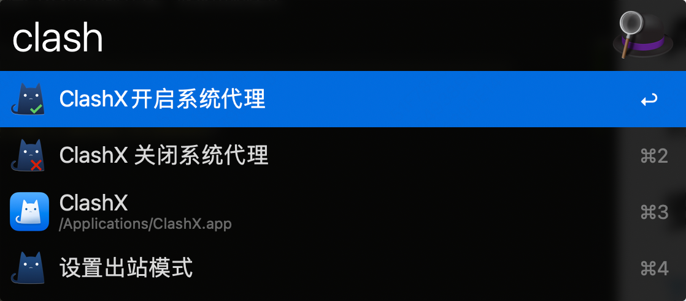
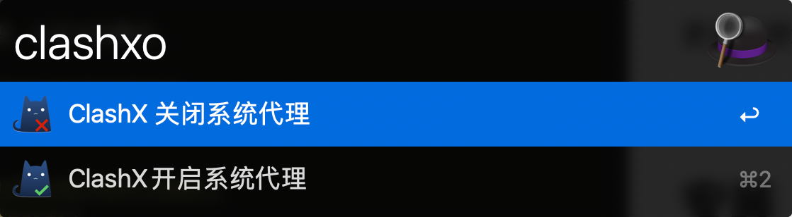
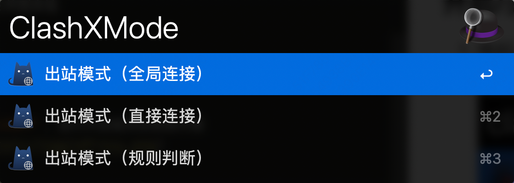
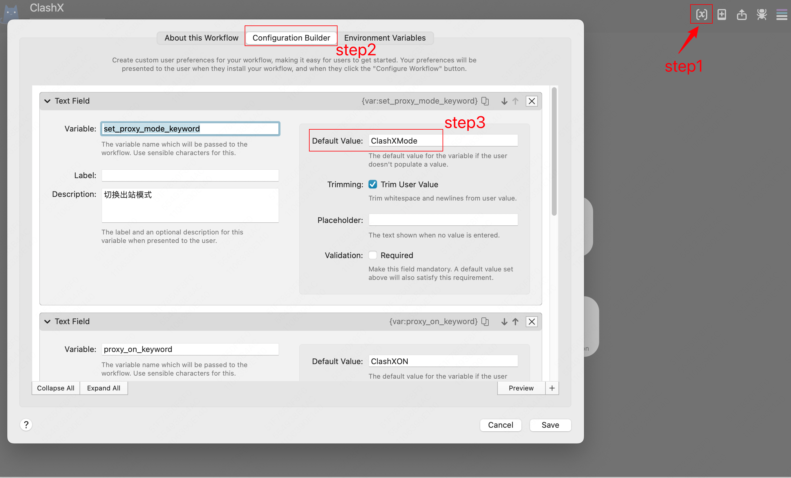

# AlfredWorkflow-ClashX

 更加方便地切换ClashX系统代理，以及出站模式。

 基于 Alfred 5 开发，不确定低版本能否正常运行。

## 安装
1. [下载地址](https://github.com/vanclimber/AlfredWorkflow-ClashX/releases)
2. 下载`.alfredworkflow`文件到本地
3. 双击打开文件，进行安装

## 使用
### 开启/关闭系统代理
1. 唤起Alfred输入框
2. 输入`ClashXON` 或`ClashXOFF`，进行开启或关闭系统代理

### 设置出站模式
1. 唤起Alfred输入框
2. 输入`ClashXMode` ，设置出库模式

3. 选择出库模式

## 修改关键字

如果不喜欢`ClashXON` 、`ClashXOFF`、`ClashXMode` 这几个关键字，可以自行修改。

1. 打开Alfred Preferences
2. 切换到Workflows tab
3. 选中此workflow，按下图修改即可

